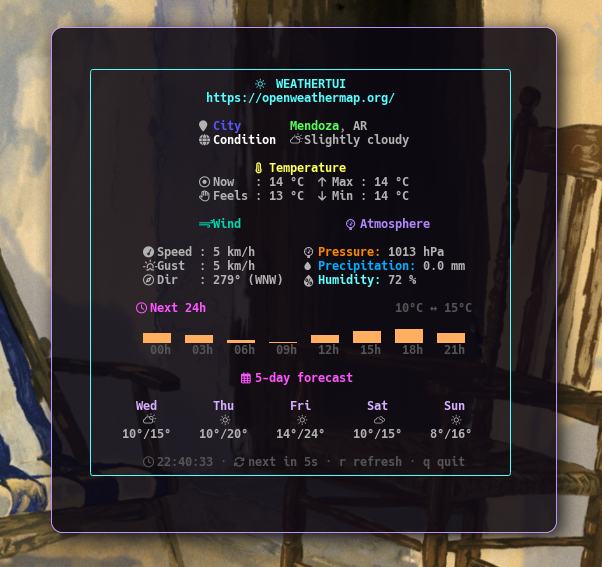

<div align="center">

# weathertui

**Terminal UI for checking the current weather, written in Go**

[](https://github.com/ncorrea-13/weathertui/actions/workflows/ci.yml)
[](https://go.dev)
[](https://github.com/charmbracelet/bubbletea)
[](https://openweathermap.org/api)
[](LICENSE)

</div>

---
<p align="center">
  
</p>

Terminal application that fetches the current weather for a city from the OpenWeatherMap API and renders it as a TUI. Single user, runs locally, no server component. Inspired by [meteo-cli](https://codeberg.org/victorhck/meteo-cli) by Victorhck, adapted to OpenWeatherMap instead of Meteoclimatic. A minimal bash equivalent lives in [`scripts/`](scripts/) as a lightweight, dependency-free alternative.

## Stack

| Layer | Tech |
| --- | --- |
| Language | Go 1.26+ |
| TUI framework | [Bubble Tea](https://github.com/charmbracelet/bubbletea) + [Lip Gloss](https://github.com/charmbracelet/lipgloss) |
| Data source | OpenWeatherMap API |

## Quick Start

### With `go install`

```bash
go install github.com/ncorrea-13/weathertui/cmd/weathertui@latest
```

### From source

```bash
git clone https://github.com/ncorrea-13/weathertui
cd weathertui
make build      # produces ./weathertui at the project root
./weathertui
```

On first run it asks for the API key, city, and country code, and saves them to `~/.config/openweather.conf`. Subsequent runs read that file directly.

### Prebuilt binaries

Download from [GitHub Releases](https://github.com/ncorrea-13/weathertui/releases).

## Configuration

No container setup, no `.env` — config lives in a single file, created interactively on first run (`internal/config/config.go`):

| Key | Required | Description |
| --- | --- | --- |
| `OWM_API_KEY` | Yes | OpenWeatherMap API key ([get one free](https://openweathermap.org/api)) |
| `CITY` | Yes | City to check the weather for (e.g. `Mendoza`) |
| `COUNTRY` | No | ISO country code (e.g. `AR`) |

## Development

```bash
make run      # go run ./cmd/weathertui
make test     # go test ./...
make install  # go install ./cmd/weathertui
make clean    # removes the compiled binary
```

## Project Structure

```
cmd/
└── weathertui/         # main entrypoint, wires config + TUI program
internal/
├── config/             # reads/writes ~/.config/openweather.conf
├── owm/                # OpenWeatherMap API client
└── tui/                # Bubble Tea model, view, styles, icons, sparkline
scripts/
├── weathertui.sh       # bash/curl/jq lightweight alternative
└── package.sh          # binary packaging for releases
```

## `scripts/weathertui.sh`

Kept as a reference/lightweight alternative — no Go toolchain needed.

```bash
./scripts/weathertui.sh              # show the weather once and exit
./scripts/weathertui.sh -w           # watch mode, refresh every 60s
./scripts/weathertui.sh -w 30        # watch mode, custom interval
./scripts/weathertui.sh -h           # help
```

Dependencies: `bash`, `curl`, `jq`, and a Nerd Font for the icons.

## License

[GPL-3.0](LICENSE), same as [meteo-cli](https://codeberg.org/victorhck/meteo-cli), the project this one is inspired by.

</content>

_Mendoza, Argentina · Nicolás Correa ([ncorrea-13](https://github.com/ncorrea-13))_
